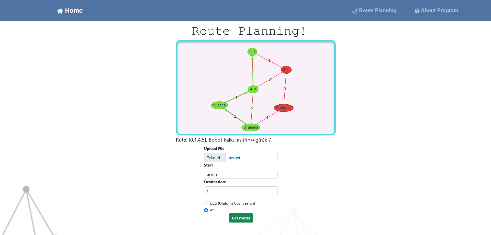

# Tucil_3_IF2211
Just ordinary routing algorithm for Stima, why so serious?

  

## The Author
| NO | NAMA | NIM |
--- | --- | --- |
| 1 | Jeremya Dharmawan Raharjo | 13521131 |
| 2 | Antonio Natthan Krishna | 13521162 |

## Overview
Tugas Kecil ini Merupakan Implementasi Algoritma UCS(Uniform Cost Search) dan A* (A-Star) dalam penentuan rute pada peta yang direpresentasikan dalam bentuk graf

## How To Run?
Silakan clone repository ini terlebih dahulu, kemudian ikuti langkah di bawah ini untuk melakukan <i>setup environment</i>. Program ini disarnkan dijalankan pada sistem operasi Ubuntu.

### Backend
Untuk menjalankan bagian belakang (backend) dari aplikasi web ini, Anda perlu menggunakan bahasa pemrograman Go. Jika Anda sudah mengunduh seluruh kode sumber dari repositori, berikut adalah cara untuk menjalankan bagian backend:

1. Install Go[https://go.dev/doc/install]
2. Untuk menjalankan di server lokal, ubah direktori ke src/backend
3. Jalankan server backend dengan command : "go run ."
4. Server backend dijalankan secara lokal pada `http://localhost:8000`

### Frontend
Pastikan anda telah menginstall NodeJS dan NPM pada sistem operasi anda. Untuk menjalankan aplikasi, lakukan prosedur sebagai berikut:
1. Lakukan instalasi NodeJS v18.15.0 dan NPM v9.6.4, berikut salah satu link yang bisa anda pakai untuk instalasi[https://nodejs.org/en/download]
   Biasanya, instalasi NPM sudah sepaket dengan NodeJS
2. Buka terminal baru yang tidak sama dengan terminal backend yang sudah dijalankan sebelumnya
3. Lakukan perubahan ke folder "frontend" pada lokal anda, kemudian jalankan perintah `npm install` untuk menginstall seluruh <i>modules dependencies</i>
   Apabila bermasalah, lakukan instalasi dependensi modul secara manual. Dependensi modul dapat dilihat pada file `package.json`.Pastikan terdapat folder `"node-modules"` pada folder `frontend` (kalau tidak ada silakan dibuat sendiri)
4. Lakukan perintah `"npm start"` pada command line anda untuk memulai aplikasi
5. Siapkan file .txt yang berisi matriks ketetanggaan berbobot untuk mengkalkulasi, format dapat menyesuaikan pada folder 
6. Akses `http://localhost:3000`untuk menjalankan aplikasi

### Running App
1. Setelah mengakses `http://localhost:3000`, pergi ke halaman `Route planning`
2. Masukkan file .txt yang sudah dengan format seperti contoh
3. Enjoy the App!
